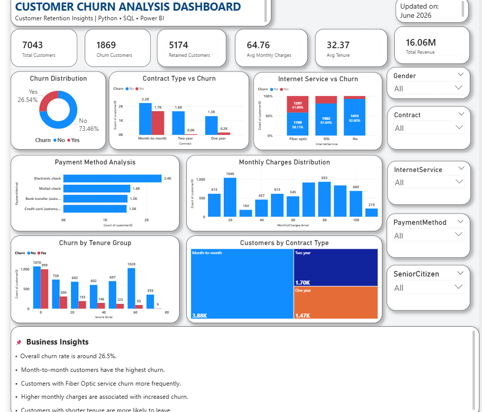

# 📊 Customer Churn Analysis

## 📌 Project Overview
This project analyzes customer churn using Power BI, SQL, and Python to identify the factors that influence customer retention and business performance. The dashboard provides interactive insights to help businesses reduce churn and improve customer satisfaction.

---

## 🎯 Objectives
- Analyze customer churn patterns
- Identify high-risk customer segments
- Monitor key business KPIs
- Support data-driven retention strategies

---

## 🛠️ Tools & Technologies
- Power BI
- SQL
- Python (Jupyter Notebook)
- Excel

---

## 📂 Dataset
The dataset contains customer demographic information, account details, services subscribed, and churn status.

---

## 📈 Dashboard Features
- Total Customers
- Churn Rate
- Customer Demographics
- Churn by Contract Type
- Churn by Payment Method
- Churn by Internet Service
- Customer Tenure Analysis

---

## 💡 Key Insights
- Month-to-month contract customers have the highest churn rate.
- Customers with shorter tenure are more likely to churn.
- Electronic Check payment method shows higher churn.
- Long-term contracts improve customer retention.

---

## 📷 Dashboard Preview

> Upload your dashboard screenshot inside the repository and replace the path below if needed.

---

## 📁 Repository Contents

- `clean_customer_churn.csv` – Dataset
- `Customer_Churn.pbix` – Power BI Dashboard
- `customerchurn.ipynb` – Python Analysis
- `customer_churn_dashboard.png` – Dashboard Screenshot

---

## 🚀 Skills Demonstrated
- Data Cleaning
- Exploratory Data Analysis (EDA)
- SQL Queries
- Power BI Dashboard Development
- DAX Measures
- Data Visualization
- Business Insights

---

## 👤 Author

**Sanju Dagar**

Aspiring Data Analyst | SQL | Python | Power BI | Excel
